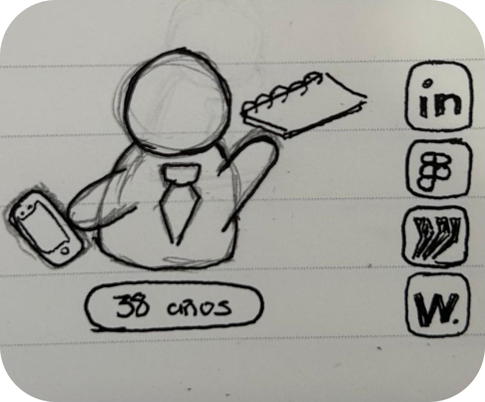

# Paisafolio | Nour Jalilie Alamo

### ¿Qúe?
Portafolio personal interactivo que permita a los *visitantes* ir armando mis trabajos para poder conocerlo. Esto sería a través de un personaje y pictogramas/iconos diseñados especificamente para mi portafolio, que en conjunto estarían "narrando" una historia. 
### ¿Para qué?
Armar la historia de mis trabajos desde su pictograma asociado y la diagramación, entregando una mayor comprensión.
### ¿Para quiénes?
### **Explorador creativo** (Extremo 1)

  
  <i><b>Demografía</b></i> 
  Estudiante de diseño digital apasionado por la innovación y la experimentación visual, en busca de inspiración para futuros proyectos.Le interesa estar al día con el estado del arte.  ߉ Vive en Santiago  
  모 Trabaja de forma independiente o en agencia creativa. 
  Interés: diseño experimental, arte digital, cultura pop e innovación 
  <i>“Me gusta cuando el diseño, permite interactuar y ser parte del proceso.”</i>

<i><b>Creencias y comportamientos</b></i>  
Explora portafolios buscando inspiración para sus propios proyectos. Le gusta interactuar con sitios con microdetalles y animaciones. Valora autenticidad y procesos detrás del resultado final. Se detiene en las interfaces que cuentan una historia o lo hacen partícipe.

<i><b>Necesidades y metas</b></i>  
Descubrir nuevas formas de mostrar su propio trabajo. Inspirarse en estructuras narrativas o visuales poco convencionales. Recordar el sitio por su originalidad o “atmósfera creativa”.

### **Gestor de innovación** (Extremo 2)

  
  <i><b>Demografía</b></i> 
  Director/a de innovación o docente en diseño digital o interactivo. Apasionada/o por su trabajo y llegó a su puesto desde el esfuerzo y perseverancia.   ߉ Vive entre Santiago y regiones 
  모 Trabaja de forma remota híbrida. 
  Interés: metodologías creativas, innovación educativa 
  <i>“La innovación tiene que ser bella, pero sobre todo tener un sentido.”</i>

<i><b>Creencias y comportamientos</b></i>  
Analiza la estructura del portafolio: navegación, jerarquía, propósito. Valora claridad conceptual y justificación de decisiones de diseño. Escanea rápido para entender cómo el proyecto comunica su proceso. Prefiere experiencias interactivas simples pero con coherencia visual.

<i><b>Necesidades y metas</b></i>  
Evaluar si el trabajo combina innovación y funcionalidad. Conocer cómo traduce conceptos experimentales en resultados concretos. Usar el portafolio como referencia o ejemplo para estudiantes o equipos.

### **Visitante Curioso** (Promedio)

  
  <i><b>Demografía</b></i> 
  Profesional o estudiante de áreas afines: diseño, arte, comunicación. Actualmente se encuentra buscando inspiración para diseñar su portafolio ideal.  ߉ Vive en Santiago 
  모 Buscando trabajo. 
  Interés: metodologías creativas, innovación educativa 
  <i>“Quiero encontrar el trabajo perfecto y para eso necesito encontrar inspo.”</i>

<i><b>Creencias y comportamientos</b></i>  
Llega por curiosidad o recomendación en redes. Recorre el sitio como si explorara una historia visual. Hace click en los íconos o personaje para descubrir qué pasa. Se queda más tiempo si la experiencia es fluida y estética.

<i><b>Necesidades y metas</b></i>  
Entretenerse mientras entiende el estilo y personalidad del autor. Encontrar algo distinto a los portafolios convencionales. Ver coherencia entre el personaje, los íconos y los proyectos.

## Antecedentes
<table>
  <tr>
    <td valign="top"  align="center" width="33%">
        
    </td>
    <td valign="top" width="33%">
        
    </td>
    <td valign="top" width="33%">
        
    </td>
  </tr>
  <tr>
    <td valign="top" width="33%">
      <b>¿Qué es?</b> <b>Folllit</b>, es un portafolio digital interactivo que combina animaciones, tipografía expresiva y navegación experimental para mostrar trabajos de diseño de forma inmersiva. El sitio usa un enfoque narrativo. 
      <b>Fuente:</b> <a href="https://www.awwwards.com/sites/folllit">Folllit</a> 
      <b>Positivos:</b> Obliga al visitante a interactuar con su sitio para acceder a otros contenidos. 
      <b>Negativos:</b> A veces hay que repetir la interacción de dibujar una cara feliz, porque no lo reconoce.
    </td>
    <td valign="top" width="33%">
      <b>¿Qué es?</b> Un template de portafolio ofrecido por <b>Cargo Collective</b> que permite a diseñadores y artistas construir un sitio web con una fuerte presencia visual, galerías dinámicas y layouts pre-construidos. 
      <b>Fuente:</b> <a href="https://cargo.site/templates/preview/2780943">Cargo Collective</a> 
      <b>Positivos:</b> Destaco su facilidad de crear portafolios desde plantillas y grillas funcionales, tiene una diagramación visual muy profesional. 
      <b>Negativos:</b> Puede limitar la fluidez y personalización de cada portafolio.
    </td>
    <td valign="top" width="33%">
      <b>¿Qué es?</b> POrtafolio de <b>Ludovic Roth</b>, exhibe proyectos que van desde mobiliario y arquitectura de interiores hasta instalaciones artísticas. 
      <b>Fuente:</b> <a href="https://ludovicroth.com/">Ludovic Roth</a> 
      <b>Positivos:</b> Destaco su claridad visual y su forma de mostrar la vista previa de sus proyectos, es eficiente y estratégica. 
      <b>Negativos:</b> Pero, puede ser mucha información visual dentro de un mismo frame.
    </td>
  </tr>
</table>

<table>
  <tr>
    <td valign="top" align="center" width="33%">
        
    </td>
    <td valign="top" align="center" width="33%">
        
    </td>
    <td valign="top" align="center" width="33%">
        
    </td>
  </tr>
  <tr>
    <td valign="top" width="33%">
      <b>¿Qué es?</b> <b>Interfaz conceptual</b> de aplicación móvil de mobiliario (UI de e-commerce) enfocada en la visualización limpia y minimalista de productos. 
      <b>Fuente:</b> <a href="https://www.instagram.com/p/Ca8hJdmvrh-/">App UI</a> 
      <b>Positivos:</b> Destaco la forma en que presenta la app, utiliza una diagramación simple pero llamativa. 
      <b>Negativos:</b> Se enfoca mucho en la funcionalidad de la app, dejando de lado la marca/app en si.
    </td>
    <td valign="top" width="33%">
      <b>¿Qué es?</b> <b>Sumatran Tiger Web</b> es una interfaz animada de ficha informativa sobre el tigre de Sumatra, que combina ilustración, animación y diseño de interacción para comunicar datos ambientales o de conservación. 
      <b>Fuente:</b> <a href="https://www.instagram.com/p/CoB1tQZgG42/">Sumatran Tiger Web</a> 
      <b>Positivos:</b> Destaco esta especie de "capas" con las que trabaja el movimiento, permite desglosar cada elemento que se está viendo, siendo una interacción interesante. 
      <b>Negativos:</b> Puede exigir un desarrollo complejo y puede verse afectada la función responsive.
    </td>
    <td valign="top" width="33%">
      <b>¿Qué es?</b> <b>Furni</b> es un diseño web de UI donde su landing page de e-commerce de mobiliario utiliza un diseño limpio, simétrico y con gran foco en la composición visual. 
      <b>Fuente:</b> <a href="https://www.instagram.com/p/CZsh8-KjY8e/">Furni</a> 
      <b>Positivos:</b> Destaco el recurso visual de cómo mostrar el costo de los objetos, es claro, simple y elegante. 
      <b>Negativos:</b> No muestra información secundaria (opiniones, contexto, detalles técnicos).
    </td>
  </tr>
</table>

## Referentes

